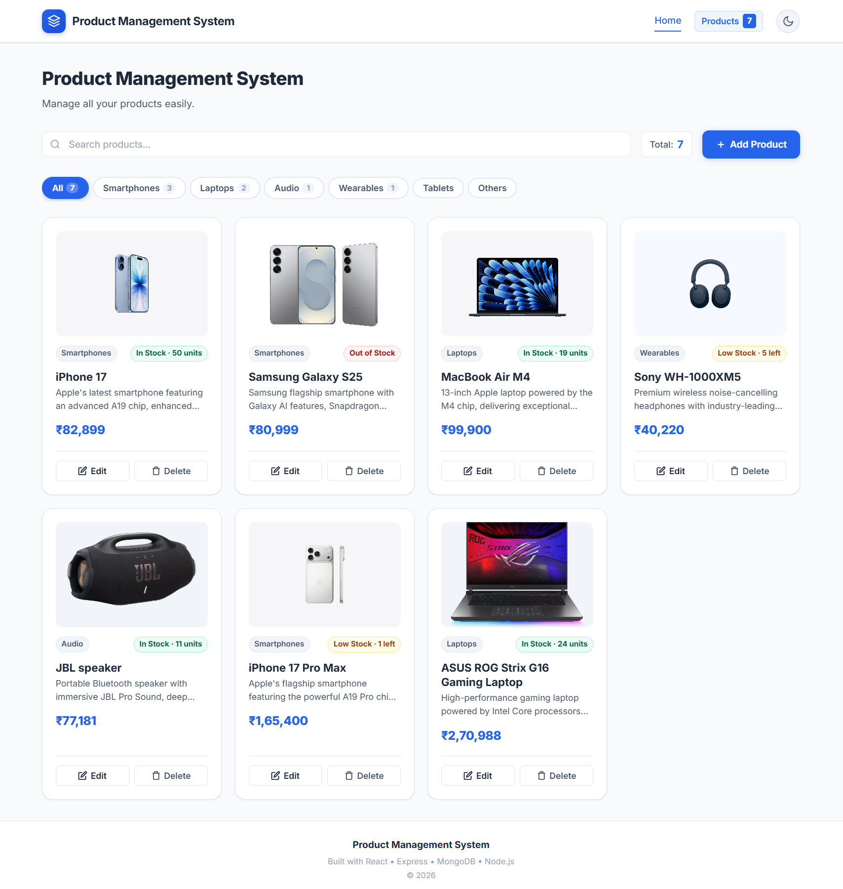
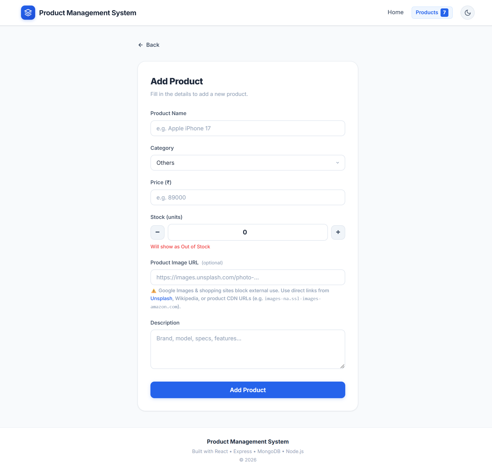
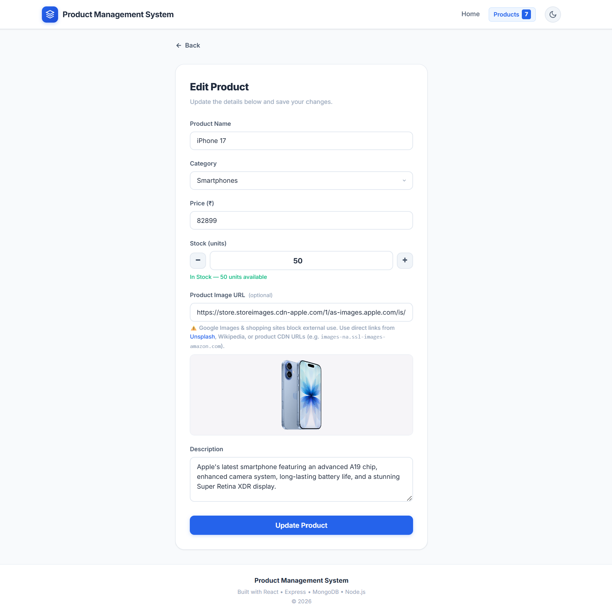
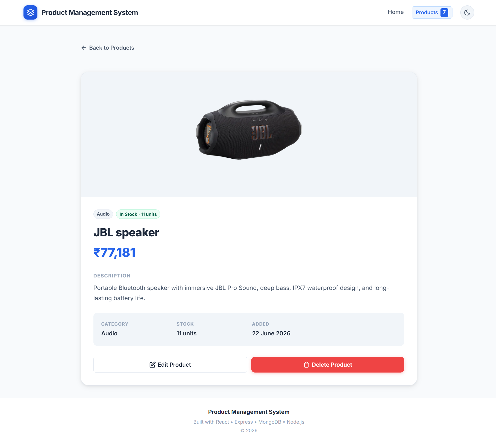

# Product Management System

A full-stack MERN (MongoDB, Express, React, Node.js) web application for managing product inventory. Built with a clean, modern UI featuring dark mode, category filtering, and stock tracking.

---

## Project

This project is a comprehensive Product Management System built to demonstrate full-stack development capabilities. It provides a complete CRUD (Create, Read, Update, Delete) interface for products, with advanced features like live search, category filtering, and local storage-based dark mode.

---

## Tech Stack

- **Frontend**: React 18, React Router v6, Vite
- **Styling**: Vanilla CSS (custom design system, Inter font)
- **Backend**: Node.js, Express 5
- **Database**: MongoDB, Mongoose 8
- **HTTP Client**: Axios

---

## Features

- **Product Grid**: View all products in a responsive, modern card layout.
- **Add & Edit Products**: Comprehensive forms to manage name, price, description, category, stock, and image.
- **Delete Confirmation**: Modal prompts to prevent accidental deletions.
- **Live Search**: Filter products by name or description in real-time.
- **Category Tabs**: Filter inventory by Smartphones, Laptops, Audio, Wearables, Tablets, and Others.
- **Stock Management**: Dynamic badges indicating In Stock, Low Stock, or Out of Stock with exact unit counts.
- **Dark Mode**: System-wide dark mode toggle, saved locally for persistence.
- **Toast Notifications**: Real-time success and error feedback for user actions.

---

## Folder Structure

```
mern-task1/
│
├── backend/
│   ├── config/
│   │   └── db.js                 # MongoDB connection
│   ├── controllers/
│   │   └── productController.js  # Route handler logic
│   ├── models/
│   │   └── Product.js            # Mongoose schema
│   ├── routes/
│   │   └── productRoutes.js      # API routes
│   ├── .env                      # Environment variables
│   ├── server.js                 # Express app entry point
│   └── package.json
│
└── frontend/
    └── src/
        ├── components/
        │   ├── Navbar.jsx         # Top navigation + dark mode toggle
        │   ├── Footer.jsx         # Footer
        │   ├── ProductCard.jsx    # Product card with image, badges, actions
        │   ├── ProductForm.jsx    # Reusable add/edit form
        │   └── SearchBar.jsx      # Live search input
        ├── pages/
        │   ├── Home.jsx           # Dashboard: grid, search, category tabs, export
        │   ├── AddProduct.jsx     # Add product page
        │   ├── EditProduct.jsx    # Edit product page
        │   ├── ProductDetail.jsx  # Full product detail page
        │   └── NotFound.jsx       # 404 page
        ├── services/
        │   └── productService.js  # Axios API calls
        ├── App.jsx                # Routes + dark mode state
        ├── index.css              # Global styles & design system
        └── main.jsx               # React entry point
```

---

## Installation

### Prerequisites

Ensure you have the following installed on your machine:
- Node.js (v18 or higher)
- MongoDB (running locally on default port 27017, or an Atlas cluster)
- npm or yarn

### 1. Clone the Repository

```bash
git clone https://github.com/your-username/mern-task1.git
cd mern-task1
```

### 2. Setup the Backend

```bash
cd backend
npm install
```

Create a `.env` file in the `backend/` directory:

```env
MONGO_URI=mongodb://localhost:27017/product-management
PORT=5000
```

### 3. Setup the Frontend

Open a new terminal window:

```bash
cd frontend
npm install
```

---

## How to Run

1. **Start the Backend**
   From the `backend/` directory, run:
   ```bash
   node server.js
   ```
   The API will be available at `http://localhost:5000`

2. **Start the Frontend**
   From the `frontend/` directory, run:
   ```bash
   npm run dev
   ```
   The React application will be available at `http://localhost:5173`

---

## API Endpoints

Base URL: `http://localhost:5000/api/products`

| Method | Endpoint | Description |
|--------|----------|-------------|
| GET | `/` | Retrieve all products |
| GET | `/:id` | Retrieve a single product by ID |
| POST | `/` | Create a new product |
| PUT | `/:id` | Update an existing product by ID |
| DELETE | `/:id` | Delete a product by ID |

---

## Screenshots

### Home Page


### Add Product Page


### Edit Product Page


### Product Card Information(Individual)


---

## Author

Developed by Mahitha Rangana.
